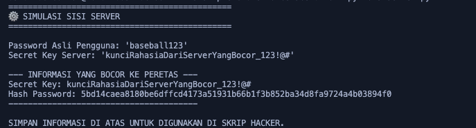
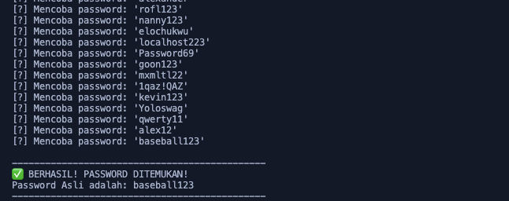

# Skenario Simulasi Brute Force

Repositori ini berisi simulasi sederhana tentang serangan brute force pada hash password.

## Deskripsi

Skenario yang disimulasikan di sini adalah ketika seseorang berusaha mengetahui password asli pengguna melalui serangan brute force.

Dalam simulasi ini:

- Penyerang berhasil melakukan ekstraksi password dari database sebuah web
- Password yang didapatkan dalam bentuk hash (server.py adalah kode untuk menghasilkan hash)
- Penyerang juga mengetahui kunci hash karena adanya kesalahan konfigurasi dari developer website yang mengekspos variabel environment ke publik
- Skrip bruteforce.py adalah bagian untuk melakukan serangan brute force, di mana penyerang akan melakukan pencocokan satu per satu hash dari wordlist yang tersedia dengan hash password target

## File dalam Repositori

- **server.py**: Simulasi sisi server yang menghasilkan hash password
- **bruteforce.py**: Simulasi sisi penyerang yang melakukan brute force
- **worlist.txt**: Daftar kata (wordlist) yang digunakan untuk serangan brute force

## Cara Penggunaan

1. Jalankan `server.py` terlebih dahulu untuk mendapatkan hash password dan secret key:

   ```
   python server.py
   ```

   

2. Salin output dari `server.py` (secret key dan hash password)

3. Jalankan `bruteforce.py` untuk memulai serangan brute force:

   ```
   python bruteforce.py
   ```

   

## Alur Kerja

1. Server menghasilkan hash password dengan menggabungkan password asli dengan secret key
2. Penyerang mendapatkan hash password dan secret key melalui kerentanan keamanan
3. Penyerang menggunakan wordlist untuk mencoba berbagai kemungkinan password
4. Untuk setiap kata dalam wordlist, penyerang menghitung hash dengan cara yang sama seperti server
5. Jika hash yang dihasilkan cocok dengan hash target, password ditemukan

## Catatan Keamanan

Simulasi ini dibuat untuk tujuan edukasi tentang kerentanan keamanan. Beberapa pelajaran keamanan yang dapat diambil:

- Jangan pernah menyimpan secret key di kode yang dapat diakses publik
- Gunakan environment variable dengan aman
- Implementasikan mekanisme rate limiting untuk mencegah serangan brute force
- Gunakan algoritma hashing yang kuat dengan salt yang unik untuk setiap pengguna
- Pastikan error message tidak mengekspos informasi sensitif

## Sumber Wordlist

Wordlist yang digunakan dalam simulasi ini diambil dari: https://github.com/danielmiessler/SecLists/blob/master/Passwords/Leaked-Databases/Lizard-Squad.txt
