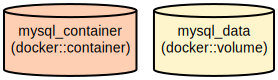

# XSS Lab: A Secure Web Application Testing Environment for Cross-Site Scripting

XSS Lab is a controlled environment designed for learning and practicing Cross-Site Scripting (XSS) vulnerabilities in web applications. It provides a realistic blog platform with user authentication, post management, and commenting features, allowing security practitioners to understand and experiment with XSS attack vectors in a safe setting.

The application implements core web functionalities including user registration, authentication, blog post viewing, and comment management. It deliberately includes certain security vulnerabilities for educational purposes while maintaining a structured environment with Docker-based deployment options for both ARM64 (Apple Silicon) and AMD64 architectures.

## Repository Structure
```
xss-lab/
├── assets/                 # Static assets directory
│   └── css/               # CSS styling files
├── templates/             # PHP template files for header and footer
├── *.php                  # Core PHP application files
│   ├── config.php         # Database and application configuration
│   ├── login.php         # User authentication handling
│   ├── register.php      # New user registration
│   ├── post.php          # Blog post display and management
│   └── comment.php       # Comment functionality
└── docker-compose-*.yml   # Docker configurations for different architectures
```

## Usage Instructions
### Prerequisites
- PHP 7.4 or higher
- MySQL 8.0
- Docker and Docker Compose
- Web server (Apache/Nginx)

### Installation

#### Using Docker
1. Choose the appropriate docker-compose file based on your architecture:

For Apple Silicon (M1/M2):
```bash
docker-compose -f docker-compose-silicon.yml up -d
```

For AMD64 systems:
```bash
docker-compose -f docker-compose.amd64.yml up -d
```

#### Manual Installation
1. Clone the repository:
```bash
git clone [repository-url]
cd xss-lab
```

2. Configure your web server to serve the application directory

3. Update database configuration in `config.php`:
```php
$db = new mysqli('127.0.0.1', 'user', 'password', 'xss_lab', 3307);
```

### Quick Start
1. Access the application through your web browser
2. Register a new user account at `/register.php`
3. Log in with your credentials
4. Browse posts and try adding comments

### More Detailed Examples

#### Creating a New Post (Admin Only)
```php
$title = "My New Post";
$content = "Post content here";
$image_path = "images/post1.jpg";
$query = "INSERT INTO posts (title, content, image_path) VALUES (?, ?, ?)";
```

#### Adding Comments
```php
// Submit a comment
POST /comment.php
{
    "post_id": "1",
    "content": "This is a comment"
}
```

### Troubleshooting

#### Common Issues

1. Database Connection Errors
```
Error: Connection refused
```
Solution:
- Verify MySQL is running: `docker ps`
- Check port mapping: Should be 3307:3306
- Confirm credentials in config.php

2. Permission Issues
```
Error: Failed to write to directory
```
Solution:
- Set proper permissions: `chmod 755 -R xss-lab/`
- Ensure web server user has write access

#### Debug Mode
Enable debug mode by adding to config.php:
```php
ini_set('display_errors', 1);
ini_set('display_startup_errors', 1);
error_reporting(E_ALL);
```

## Data Flow
The application follows a traditional web application architecture where user requests are processed through PHP scripts that interact with a MySQL database.

```ascii
User Request → PHP Handler → MySQL Database
     ↑            ↓             ↓
     └────── HTML Response ←────┘
```

Key component interactions:
1. User authentication flows through login.php/register.php
2. Post viewing handled by index.php and post.php
3. Comments processed by comment.php
4. All database interactions centralized through config.php
5. Templates provide consistent layout via header.php/footer.php

## Infrastructure



### Database Resources
- MySQL 8.0 container
  - Database: xss_lab
  - Port: 3307 (mapped to 3306)
  - Persistent volume: mysql_data

### Tables
1. users
   - id (PRIMARY KEY)
   - username (UNIQUE)
   - password
2. posts
   - id (PRIMARY KEY)
   - title
   - content
   - image_path
3. comments
   - id (PRIMARY KEY)
   - post_id (FOREIGN KEY)
   - user_id (FOREIGN KEY)
   - content